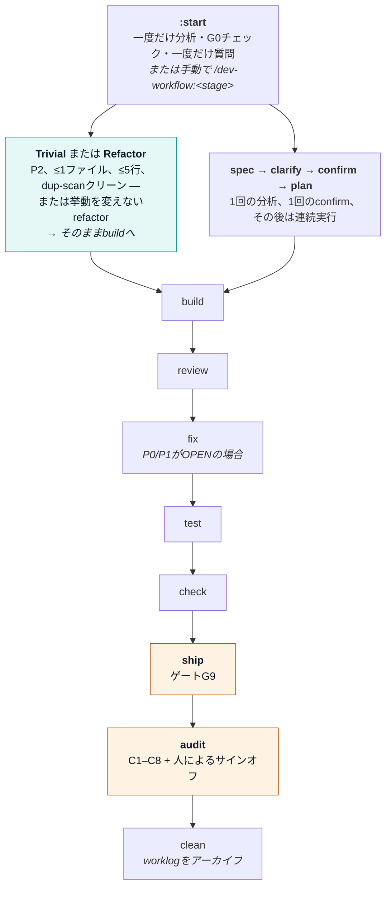
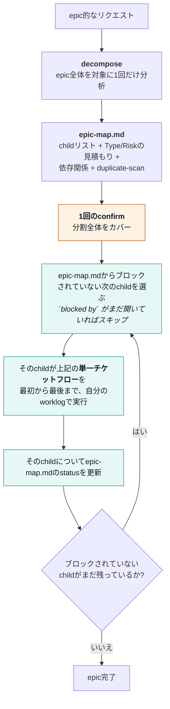

<picture>
  <source media="(prefers-color-scheme: dark)" srcset="./assets/logo/logo-dark.svg">
  
</picture>

# dev-workflow

[](CHANGELOG.md)
[](LICENSE)
[](#installation)

[English](README.md) · [Tiếng Việt](README.vi.md) · **[日本語](README.ja.md)**

> **要件ファーストのAI開発ワークフロー。** 明確な仕様 → 人によるconfirm → TDD → 機械検証済みエビデンス →
> 安全なship。チェッカー（`bin/check-gates.sh`）が唯一の真実の源であり、AIがPASSを自称することは許されない。

**詳しい使い方（推奨）:** [docs/USER-GUIDE.md](./docs/USER-GUIDE.md)

---

## 目次

- [なぜ](#why)
- [フロー](#flow)
- [インストール](#installation)
- [クイックスタート](#quick-start)
- [コマンド](#commands)
- [ゲートとリスク](#gates--risk)
- [Confirmフレーズ（必須）](#confirm-phrase-required)
- [Worklogアーティファクト](#worklog-artifacts)
- [CLIによる強制](#cli-enforcement)
- [組織CI & パイロット](#org-ci--pilot)
- [ドキュメントマップ](#documentation-map)
- [ライセンス](#license)

---

## なぜ

ゲート付きプロセスがない場合、AIによるコーディングはよく次のような問題を起こす:

- ビジネスルールの見落とし
- UI/ロジックのバグをそのままship
- エビデンスなしに「完了」と表示する

dev-workflowは、構造的ゲート G0–G9 と必須の意味論的AUDITがPASSするまで先に進めないようブロックする。
これはRiskレーン（P0/P1/P2）、エビデンスの来歴（provenance）、任意のpilotスコアリングに支えられている。

---

## フロー

`learning`/`coaching` は配信パイプラインから独立して動作する — ドメイン知識を初期構築・修正する際は自分で直接呼び出す。
`:start` はこれらを一切自動起動しない。G0で止まり、あなた自身に実行を促すだけだ。

`:start`（`/dev-workflow` の裸のエイリアスでもある）は1チケットに対する唯一のエントリーポイントだ — 同じゲート、
近道なし、各stageを手動で呼ぶより停止回数が少ないだけ。リクエストがepic的な形をしている場合は
`:decompose` が先に走り、その後1チケットフローをchildごとに順番に引き渡す。

### 単一チケットフロー



`:start` はG0で止まり、ドメイン知識が不足または矛盾している場合は `:learning`/`:coaching` へあなたを誘導する —
自分で実行することは一切ない。`check-gates.sh --strict` はマージ前とAUDIT前に使うCIネイティブな検証であり、
パイプラインの独立したstageではなく、単に `check` に付けるフラグにすぎない。

### Epicフロー（上記の単一チケットフローをchildごとにループ）



`:decompose` はプロジェクトレベルで `epic-map.md` を書き込み（どのチケットのworklog内にも置かない）、
ブロックされていない**最初の**childだけを引き渡す — 複数childの `:spec`/`:start` を自分でまとめて
発行することはない。各childは自分自身の完全な単一チケットフロー（独自のRisk tier、独自の `CONFIRM G3`、
独自のG0–G9 + AUDIT）を持つ — epicの1回のconfirmは分割自体とepicレベルの質問だけを承認するものであり、
どのchildの独自ゲートも代替しない。decompose中に発見されたP0のchildは、他の方法で見つかったP0チケットと
まったく同じ厳格さでゲートされる。`epic-map.md` は多階層epic（child自体がさらに分岐するケース）に対しては
検証されていない — 依存グラフはフラットなchildリストに対してのみ信頼できるものとして扱い、childがさらに
decomposeを必要としそうな場合はその旨を明示すること。

| ステップ | 意味 |
|------|---------|
| decompose | epicをchildチケット + 依存関係に分割; 1回のconfirmで分割全体をカバー |
| start | デフォルトのエントリーポイント: 一度だけ分析、一度だけ質問、最初の本当の停止点まで実行 |
| learning / coaching | AIがドメインを学習; あなたが誤りを修正 |
| spec | テスト可能なAC + **Risk P0/P1/P2**（P0なら `02b-security.md` も） |
| clarify | Type別にspec/意図と実際の挙動を照合; 決定事項を記録 |
| confirm | AIが記入済みの `CONFIRM G3:…` 行を渡す; 名前を編集して送り返す（下記参照） |
| plan / build | TDDプラン + 実装 + カバレッジマップ |
| review / fix / test | diffの指摘 + トリアージ/修正 + 機械エビデンス（SHA/CI/junit） |
| check / ship / audit / clean | 構造的ゲート; ship安全性; 意味論的な最終確認; worklogのアーカイブ |

`:start` と名前付きの `/dev-workflow:<stage>` コマンドはどちらもチケット作業の有効な方法だ —
`:start` は「とにかく終わらせたい」場合の停止回数を最小化し、各stageを自分で呼べば1つの特定ステップを
完全に手動制御できる。どちらもゲートを弱めることはない: `:start` は手動パスとまったく同じ
`check-gates.sh` のチェックを実行する。

**上記のすべてのstageは単独でも動作する — この図は完全な道筋であって、必須要件ではない。** ディスク上に
上流アーティファクトがまだないチケットに対して、どの `/dev-workflow:<stage>` も直接呼び出せる;
`clarify`、`plan`、`build` は本来読むはずだった `spec`/`clarify`/`plan` の出力の代わりにチケットを
自分で分析し、結果を `Source: self-analyzed (no upstream artifact)` とマークすることで、後続のstageや
人間がそれが確認済みscopeから作られたものではないと分かるようにする。1行のタイポ修正なら
`spec` → `clarify` → `confirm` のフルラウンドトリップは不要だ: `/dev-workflow:build <Ticket>` を
直接実行すれば、自分でチケットを読んでプランと実装を行う。この方法で決して緩まない唯一の2つのstageは
`confirm` と `audit` だ — その人間によるサインオフは自己分析で代替できない。他の各stageがどこまで
緩むか（警告のみ vs. 自己分析 vs. 完全停止）はstageごとに異なり、統一されていない — 実際のstageごとの
ルールは `references/stage-contract.md` の `(preferred)` 列を、どのstageがどのようにフォールバックするかは
`references/workflow.md` の "Independence" セクションを参照。

---

## インストール

### 前提条件

- Bash 3.2以上
- Claude Code、Cursor、Codex、Antigravity のいずれか
- Git
- `agy` は `--agy` または `--all` のときのみ必要

### クローンしてcoding agentを選ぶ

```bash
git clone https://github.com/ninhlee99/dev-workflow.git
cd dev-workflow
bash install.sh                         # デフォルト: Claudeのみ
bash install.sh --cursor                # Cursorのみ
bash install.sh --codex                 # Codexのみ
bash install.sh --agy                   # Antigravityのみ（agyが必要）
bash install.sh --all                   # サポートされる全エージェント
```

`install.sh` は選択したhostのみをインストールする。CursorとCodexは18個のstage skillすべてをlive状態で
受け取る; それらのskillディレクトリはこのcloneにリンクされているため、skillの内容が古いコピーになることはない。
`~/.claude`、`~/.cursor`、`~/.codex`、（任意で）`~/.agents` の下にhost統合ファイルを書き込む;
製品ソースは編集しない。完全なインストール/更新/検証ガイド: [docs/INSTALL.md](./docs/INSTALL.md)。

ターゲットフラグは1つだけ選ぶこと。矛盾するフラグは拒否され、`--all` はどのhostも変更する前に
`agy` の有無をチェックする。

### Claude Code

```text
/plugin marketplace add https://github.com/ninhlee99/dev-workflow
/plugin install dev-workflow@dev-workflow-marketplace
/reload-plugins
```

### Antigravityの手動同等手順

```bash
bash hosts/antigravity/rebuild.sh
agy plugin validate ./hosts/antigravity
agy plugin install ./hosts/antigravity
```

hostの詳細: [MARKETPLACE.md](./MARKETPLACE.md)。

### 更新

既存のcloneから、インストール時と同じターゲットで実行する:

```bash
bash update.sh             # Claudeのみ（デフォルト）
bash update.sh --cursor    # Cursorのみ
bash update.sh --codex     # Codexのみ
bash update.sh --agy       # Antigravityのみ（agyが必要）
bash update.sh --all       # サポートされる全エージェント（agyが必要）
```

Updateはdirtyなworktreeを拒否し、`--ff-only` でpullし、選択したhostのみをrefreshする。
ローカルのリポジトリ変更をstash、reset、上書きすることは決してない。

### アンインストール

インストール時と同じターゲットモデルを使う:

```bash
bash uninstall.sh             # Claudeのみ（デフォルト）
bash uninstall.sh --cursor    # Cursorのみ
bash uninstall.sh --codex     # Codexのみ
bash uninstall.sh --agy       # Antigravityのみ（agyが必要）
bash uninstall.sh --all       # サポートされる全エージェント（agyが必要）
```

Uninstallはdev-workflowが所有するhostエントリーのみを削除する。リポジトリのclone、worklog、
無関係なhost設定、変更済みのCodex marketplaceファイルは保持される。

---

## クイックスタート

```text
# 1) プロジェクトで初めて使うとき
/dev-workflow:learning

# 2) リクエストがepic的な形？ どのchild worklogを開く前にも先に分割する。
/dev-workflow:decompose "split the payment monolith into its own service"
# → epic-map.md + 1回のconfirm、その後ブロックされていない最初のchildへ引き渡す

# 3) チケットを開始する（デフォルトのエントリーポイント — 一度だけ分析、一度だけ質問、最初の本当の停止点まで実行）
/dev-workflow TICKET-123 https://tracker/TICKET-123

# ...またはTicket IDなしでも — 事前にIDは不要で問題なく動く
/dev-workflow "fix the confirm-order button text"
# → 決定を保存する必要が生じた時点でAIが worklogs/adhoc-confirm-btn-text/ を導出する;
#   純粋なQ&A/読み取り専用の作業にはworklogは一切不要

# ...または本当にtrivialな修正（1ファイル、≤5行、公開識別子の変更なし、
# duplicate-scanクリーン）— 質問なしで実行して報告する:
/dev-workflow "fix the typo in the error message"
# → :build が即座に実行され、INDEXに1行のログ、フルworklogなし、返信待ちなし

# 4) 典型的な手動パス
/dev-workflow:spec     TICKET-123
/dev-workflow:clarify  TICKET-123
/dev-workflow:confirm  TICKET-123    ← AIが記入済みのCONFIRM G3:行を渡す; 名前を編集して送り返す
/dev-workflow:plan     TICKET-123
/dev-workflow:build    TICKET-123
/dev-workflow:review   TICKET-123
/dev-workflow:fix      TICKET-123    ← P0/P1の指摘がOPENの場合
/dev-workflow:test     TICKET-123
/dev-workflow:check    TICKET-123
/dev-workflow:ship     TICKET-123
/dev-workflow:audit    TICKET-123    ← P0/P1の最終確定に必須; 人によるAUDIT CONFIRM
/dev-workflow:clean    TICKET-123    ← 完了後; worklogメモリを解放

# いつでも
/dev-workflow:status TICKET-123
```

チャットとセットアップはあなたの言語に従う（[references/locale.md](./references/locale.md) 参照）;
上記の例は読みやすさのため英語で示している。会話型stage（`:spec`、`:clarify`、`:plan`、`:build`、
`:start`、`:decompose`）ではTicket IDは省略可能 — 省略してもstageは実行される;
worklogが実際にいつ作られるかは、[コマンド](#commands)の下の `[Ticket]` の注記を参照。

Worklogの保存場所: `~/.workspaces/<project-slug>/worklogs/<Ticket_ID-or-adhoc-slug>/`。

例付きのステップバイステップ: [docs/USER-GUIDE.md](./docs/USER-GUIDE.md)。

---

## コマンド

| コマンド | 引数 | 効果 |
|---------|-----------|--------|
| `/dev-workflow:decompose` | `<epic description/path>` | epicをchildチケット + 依存関係に分割; `epic-map.md`、1回のconfirm |
| `/dev-workflow:learning` | `[brief/path]` | AIが `domain-knowledge/` を構築; 不明点は質問する |
| `/dev-workflow:coaching` | `<topic/ticket>` | あなたが修正 / 新規または変更されたspecを教える |
| `/dev-workflow` | `[Ticket] [URL]` | デフォルトのエントリーポイント: 一度だけ分析、一度だけ質問、最初の本当の停止点まで実行; Ticketは任意、省略時は自動導出 |
| `/dev-workflow:spec` | `[Ticket] [URL/spec]` | Type/Risk、provenance、ACを設定; P0 → securityファイル; Ticketは任意、省略時は自動導出 |
| `/dev-workflow:clarify` | `[Ticket] [decision]` | clarifyレポート + QAログを書く; Ticketは任意、省略時は自動導出 |
| `/dev-workflow:confirm` | `<Ticket>` | 記入済みの `CONFIRM G3:` 行をユーザーに渡す; INDEX + `03b-human-confirm.md` を書く |
| `/dev-workflow:plan` | `[Ticket]` | AC/claimにマップされたTDDプラン; Ticketは任意、省略時は自動導出 |
| `/dev-workflow:build` | `[Ticket]` | 実装 + カバレッジマップ; プランが未作成なら自己分析; Ticketは任意、省略時は自動導出 |
| `/dev-workflow:review` | `<Ticket>` | 中立的なdiffレビュー + How/By（`06-review-qa.md`） |
| `/dev-workflow:fix` | `<Ticket>` | 指摘をトリアージ; 妥当なものだけ修正（`06c-fix-log.md`） |
| `/dev-workflow:test` | `<Ticket>` | 実際のテスト + SHA/CI/junit（`06b-test-evidence.md`） |
| `/dev-workflow:check` | `<Ticket> [slug] [G8\|G9\|AUDIT]` | 決定論的チェッカーを実行 |
| `/dev-workflow:ship` | `<Ticket>` | `07-ship.md`（G9）を記入; checkerが失敗すれば拒否 |
| `/dev-workflow:audit` | `<Ticket>` | C1–C8の整合性をチェック; 人によるサインオフを要求 |
| `/dev-workflow:clean` | `<Ticket> [--force] [--purge]` | そのチケットのworklogのみをアーカイブ/削除 |
| `/dev-workflow:status` | `[Ticket]` | ゲート + knowledgeの状態 |
| `/dev-workflow:feedback` | `[free text]` | dev-workflow自体のバグ/不満点をGitHub issueとして報告 |

`[Ticket]` = 任意 — 省略してもstageは実行される; 短い `adhoc-<slug>` のworklog名は決定を保存する
必要が生じた時点でのみ導出される（`references/task-isolation.md` 参照）。`<Ticket>` = 必須のまま —
これらのstageは特定のチケットに紐づく機械検証済みエビデンスを書き込み/検証する。

---

## ゲートとリスク

この表は読者向けの要約であり、`references/stage-contract.md` が権威ある情報源だ —
両者が食い違う場合はcontractファイルが優先される; まずそちらを編集してから、この表を同期すること。

| ゲート | PASSの意味 | やり直すコマンド |
|------|------------|------------|
| **G0** | ドメイン知識がチケットをカバーしている | `:learning` / `:coaching` |
| **G1** | 単一のType + Risk、要件のprovenance、AC（P0ならsecurityも） | `:spec` |
| **G2** | 矛盾が解決済み（`--strict` でなければP2はsoft） | `:clarify` |
| **G3** | INDEX **かつ** `03b-human-confirm.md` に人によるconfirm（`--strict` でなければP2はsoft） | `:confirm` |
| **G4** | プランがマップ済み（`--strict` でなければP2はsoft） | `:plan` |
| **G5** | OPENな質問なし（`--strict` でなければP2はsoft） | `:clarify` |
| **G6** | カバレッジマップ + PASS | `:build` |
| **G7** | レビュー: OPENなP0/P1なし + エビデンス（`--strict` でなければP2はsoft） | `:review` / `:fix` |
| **G8** | テスト + 機械エビデンス（`--strict` = CIネイティブ） | `:test` |
| **G9** | ship安全性（canary/soak/on-call/SLO/rollback） | `:ship` |
| **AUDIT** | エビデンス付きの8つの整合性ペア + 人によるサインオフ; UNCLEAR/INCOHERENTなし | `:audit` |

| Risk | レーン | 備考 |
|------|------|-------|
| **P0** | Hard | 金銭/認可/PII/legacy — 二重CONFIRM、security、G0–G9 + AUDIT |
| **P1** | Hard | 通常のプロダクト変更（デフォルト） — 完全なG0–G9 + AUDIT |
| **P2** | Fast | 雑務 — `--strict` でなければG2/G3/G4/G5/G7はsoft; 人によるCONFIRMラウンドトリップ不要 |

**Trivial**（P2に対するフィルタであり、4番目のtierではない）: P2 + ≤1ファイル + ≤5行 +
公開識別子の変更なし + duplicate-scanクリーン → `:start` はP2の「提案して待つ」をスキップし、
そのまま `:build` を実行する。1行のINDEXログを残し、事前に聞く代わりに事後報告する。
duplicate-scanが他の出現箇所を見つけた場合は通常のP2にフォールバックする。`≤5行` という数値は
検証されていない初期的な推測値（epic-signalの4-claimバックストップと同じ扱い） —
`references/risk.md` の "Trivial" を参照。

詳細: [references/risk.md](./references/risk.md)。権威あるstageインターフェースは
[references/stage-contract.md](./references/stage-contract.md); すべてのskillは
[references/skill-quality.md](./references/skill-quality.md) のエビデンスと真実性の基準に従う。

### WAIVE

`INDEX.md` にて:

```text
- G4/task-2 | reason | owner | 2026-12-31 | PM note
```

金銭/権限/legacyについてはPMなしでWAIVE不可。P0はG3/G8をWAIVEできない。

---

## Confirmフレーズ（必須）

`:confirm` はこの行を記入済みの状態で渡す（チケットと日付はすでに入っている）— 名前を編集して送り返す:

```text
CONFIRM G3: TICKET-123 Your Name 2026-08-11
```

P0はさらに:

```text
CONFIRM G3-PM: TICKET-123 PM Name 2026-08-11
```

名前フィールドで禁止: `AI`、`ChatGPT`、`Claude`、`Copilot`、`Cursor`、`Assistant`、`Bot`。
**INDEX.md** と **03b-human-confirm.md** の両方に `Source: user-message` として保存されている必要がある。

---

## Worklogアーティファクト

```
~/.workspaces/<project-slug>/
├── PROJECT.md
├── domain-knowledge/
├── repos/<repo-slug>/
├── pilot/PILOT-v0.4.md          # 任意の測定可能な証拠
└── worklogs/<Ticket_ID>/
    ├── INDEX.md                 # Risk、Pilot、ゲート、CONFIRM、waiver
    ├── 01-intent.md
    ├── 02-spec.md
    ├── 02b-security.md          # P0のみ
    ├── 03-clarify-report.md
    ├── 03-qa-log.md
    ├── 03b-human-confirm.md     # 人による正確なCONFIRM文言
    ├── 04-plan.md
    ├── 05-impl-log.md
    ├── 06-review-qa.md
    ├── 06c-fix-log.md            # :fix 後（トリアージ）
    ├── 06b-test-evidence.md
    ├── 07-ship.md
    └── 08-semantic-audit.md       # C1–C8 + AUDIT CONFIRM
```

---

## CLIによる強制

```bash
export DEV_WORKFLOW_PLUGIN=/path/to/dev-workflow

# マージ前の構造的な最低ライン
"$DEV_WORKFLOW_PLUGIN/bin/check-gates.sh" TICKET-123 \
  --project my-project --min G9 --strict

# semantic audit + 人によるサインオフ後の最終P0/P1チェック
"$DEV_WORKFLOW_PLUGIN/bin/check-gates.sh" TICKET-123 \
  --project my-project --min AUDIT --strict

# パイロットスコア（10チケット後）
"$DEV_WORKFLOW_PLUGIN/bin/pilot-score.sh" \
  workspaces/my-project/pilot/PILOT-v0.4.md
```

| フラグ | デフォルト | 意味 |
|------|---------|---------|
| `--project` | 自動 | プロジェクトのslug |
| `--min` | `G8` | `G0`…`G9` または `AUDIT` までチェック; 最終P0/P1は `AUDIT` を使う |
| `--strict` | オフ | SHA/junit検証; `--verify-net` を含意; P2 softなし; G8のWAIVEなし |
| `--verify-net` | オフ*（`--strict`ならオン） | CI URLへのHTTP HEAD |
| `--json` | オフ | 機械可読な結果 |

Exit: `0` PASS · `1` FAIL · `2` 使用法/パスエラー。

---

## 組織CI & パイロット

1. [templates/ci/github-actions-dev-workflow.yml](./templates/ci/github-actions-dev-workflow.yml) を**製品**リポジトリにコピー。
2. デフォルトブランチで `dev-workflow-gates` ステータスチェックを必須にする。
3. 10チケットのパイロットを実行 → `pilot-score.sh` がexit 0であること。

[docs/USER-GUIDE.md §7](./docs/USER-GUIDE.md#7-pilot-prove-the-workflow-works) と
[references/maturity.md](./references/maturity.md) を参照。

---

## ドキュメントマップ

| ドキュメント | 対象読者 | 内容 |
|-----|----------|---------|
| **[docs/USER-GUIDE.md](./docs/USER-GUIDE.md)** | 開発者 | 日々の使い方の完全ガイド |
| [docs/INSTALL.md](./docs/INSTALL.md) | インストール担当者 | インストール、更新、検証、hostごとのパス |
| [MARKETPLACE.md](./MARKETPLACE.md) | インストール担当者 | host別インストール + smoke test |
| [STRUCTURE.md](./STRUCTURE.md) | Contributor | 注釈付きツリー |
| [CONTRIBUTING.md](./CONTRIBUTING.md) | Contributor | プラグインを変更する方法 |
| [CHANGELOG.md](./CHANGELOG.md) | 全員 | バージョン履歴 |
| [references/](./references/) | AI + 上級ユーザー | ゲート、risk、security、pilot、enforce |

---

## ライセンス

[MIT](LICENSE)
