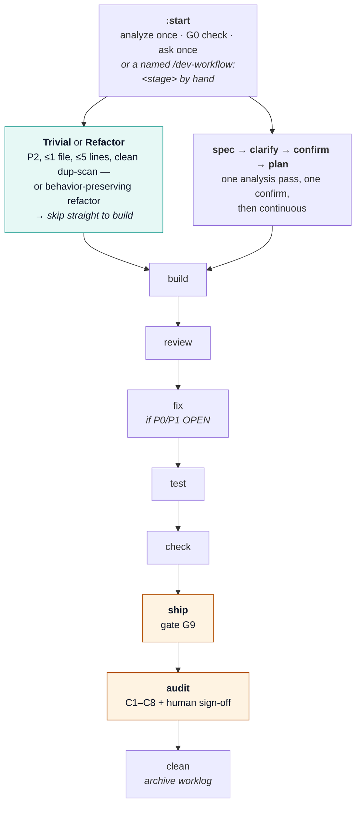
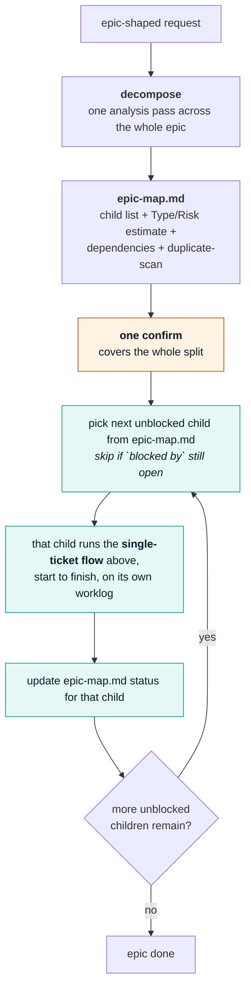

<picture>
  <source media="(prefers-color-scheme: dark)" srcset="./assets/logo/logo-dark.svg">
  
</picture>

# dev-workflow

[](CHANGELOG.md)
[](LICENSE)
[](#installation)

**[English](README.md)** · [Tiếng Việt](README.vi.md) · [日本語](README.ja.md)

> **Requirement-first AI delivery workflow.** Clear specs → human confirm → TDD → machine-verified evidence → safe ship. The checker (`bin/check-gates.sh`) is the source of truth — the AI must not invent a PASS.

**Full how-to (recommended):** [docs/USER-GUIDE.md](./docs/USER-GUIDE.md)

---

## Table of contents

- [Why](#why)
- [Flow](#flow)
- [Installation](#installation)
- [Quick start](#quick-start)
- [Commands](#commands)
- [Gates & risk](#gates--risk)
- [Confirm phrase (required)](#confirm-phrase-required)
- [Worklog artifacts](#worklog-artifacts)
- [CLI enforcement](#cli-enforcement)
- [Org CI & pilot](#org-ci--pilot)
- [Documentation map](#documentation-map)
- [License](#license)

---

## Why

Without a gated process, AI coding often:

- Misses business rules
- Ships UI/logic bugs
- Marks "done" without evidence

dev-workflow blocks progress until structural gates G0–G9 and the required semantic AUDIT pass, backed
by Risk lanes (P0/P1/P2), evidence provenance, and optional pilot scoring.

---

## Flow

`learning`/`coaching` run independently of the delivery pipeline — you call them directly to
bootstrap or correct domain knowledge. `:start` never invokes them; it stops at G0 and asks you to
run them yourself.

`:start` (also the bare `/dev-workflow` alias) is the single entry point for one ticket — same
gates, no shortcuts, just fewer stops than calling each stage by hand. `:decompose` runs first when
the request is epic-shaped, then hands the single-ticket flow one child at a time.

### Single-ticket flow



`:start` stops at G0 and hands you to `:learning`/`:coaching` if domain knowledge is missing or
contradicted — it never runs either for you. `check-gates.sh --strict` is the CI-native verify used
before merge and again before AUDIT; it is not a separate pipeline stage, just a flag on `check`.

### Epic flow (loops the single-ticket flow above, one child at a time)



`:decompose` writes `epic-map.md` at the project level (not inside any one ticket's worklog) and
hands off only the **first** unblocked child — it never dispatches multiple children's
`:spec`/`:start` itself. Each child gets its own full single-ticket flow (own Risk tier, own
`CONFIRM G3`, own G0–G9 + AUDIT) — the epic's one confirm authorizes the split and the epic-level
questions; it does not substitute for any child's own gates. A P0 child found during decomposition is
exactly as hard-gated as a P0 ticket found any other way. `epic-map.md` has not been validated
against a multi-level epic (children that themselves fan out) — treat the dependency graph as
reliable for a flat child list only, and say so explicitly if a child looks like it needs
decomposing again.

| Step | Meaning |
|------|---------|
| decompose | Split an epic into child tickets + dependencies; one confirm covers the split |
| start | Default entry point: analyze once, ask once, then run to the first real stop |
| learning / coaching | AI learns domain; you correct mistakes |
| spec | Testable ACs + **Risk P0/P1/P2** (+ `02b-security.md` if P0) |
| clarify | Type-specific spec/intent vs running behavior; decisions recorded |
| confirm | AI hands you a pre-filled `CONFIRM G3:…` line; edit name, send it back (see below) |
| plan / build | TDD plan + implementation + coverage map |
| review / fix / test | Diff findings + triage/fix + machine evidence (SHA/CI/junit) |
| check / ship / audit / clean | Structural gates; ship safety; semantic finality; archive worklog |

`:start` and the named `/dev-workflow:<stage>` commands are both valid ways to work a ticket —
`:start` minimizes stops for "just get this done"; calling each stage yourself gives full manual
control over one specific step. Neither weakens a gate: `:start` runs the exact same
`check-gates.sh` checks the manual path does.

**Every stage above runs standalone — the diagram is the full path, not a hard requirement.** Call
any `/dev-workflow:<stage>` directly on a ticket with no upstream artifact on disk yet; `clarify`,
`plan`, and `build` self-analyze the ticket in place of the missing `spec`/`clarify`/`plan` output
they'd normally read, and mark the result `Source: self-analyzed (no upstream artifact)` so later
stages and humans can see it wasn't built from confirmed scope. A one-line typo fix doesn't need a
full `spec` → `clarify` → `confirm` round-trip: run `/dev-workflow:build <Ticket>` directly, and it
plans and implements from its own reading of the ticket. The only two stages that never soften this
way are `confirm` and `audit` — their human sign-off can't be self-analyzed. Exactly how much each
other stage softens (warn vs. self-analyze vs. full stop) is per-stage, not uniform — see the
`(preferred)` column in `references/stage-contract.md` for the actual per-stage rule, and the
"Independence" section of `references/workflow.md` for exactly which stages fall back this way.

---

## Installation

### Prerequisites

- Bash 3.2+
- One of: Claude Code, Cursor, Codex, Antigravity
- Git
- `agy` only for `--agy` or `--all`

### Clone and choose a coding agent

```bash
git clone https://github.com/ninhlee99/dev-workflow.git
cd dev-workflow
bash install.sh                         # default: Claude only
bash install.sh --cursor                # Cursor only
bash install.sh --codex                 # Codex only
bash install.sh --agy                   # Antigravity only (requires agy)
bash install.sh --all                   # all supported agents
```

`install.sh` installs only the selected host. Cursor and Codex receive all 18 live stage skills;
their skill directories link to this clone, so skill content does not become a stale copy.
It writes host integration files under `~/.claude`, `~/.cursor`, `~/.codex`, and optionally
`~/.agents`; it does not edit product source. See the complete install/update/verification guide:
[docs/INSTALL.md](./docs/INSTALL.md).

Choose one target flag. Conflicting flags are rejected, and `--all` checks for `agy` before making
any host changes.

### Claude Code

```text
/plugin marketplace add https://github.com/ninhlee99/dev-workflow
/plugin install dev-workflow@dev-workflow-marketplace
/reload-plugins
```

### Antigravity manual equivalent

```bash
bash hosts/antigravity/rebuild.sh
agy plugin validate ./hosts/antigravity
agy plugin install ./hosts/antigravity
```

More host detail: [MARKETPLACE.md](./MARKETPLACE.md).

### Update

Run from the existing clone with the same target used during installation:

```bash
bash update.sh             # Claude only (default)
bash update.sh --cursor    # Cursor only
bash update.sh --codex     # Codex only
bash update.sh --agy       # Antigravity only (requires agy)
bash update.sh --all       # all supported agents (requires agy)
```

Update refuses a dirty worktree, pulls with `--ff-only`, and refreshes the selected host only. It
never stashes, resets, or overwrites local repository changes.

### Uninstall

Use the same target model as installation:

```bash
bash uninstall.sh             # Claude only (default)
bash uninstall.sh --cursor    # Cursor only
bash uninstall.sh --codex     # Codex only
bash uninstall.sh --agy       # Antigravity only (requires agy)
bash uninstall.sh --all       # all supported agents (requires agy)
```

Uninstall removes only dev-workflow-owned host entries. It preserves the repository clone,
worklogs, unrelated host configuration, and any modified Codex marketplace file.

---

## Quick start

```text
# 1) First time on a project
/dev-workflow:learning

# 2) Epic-shaped request? Split before opening any child worklog.
/dev-workflow:decompose "split the payment monolith into its own service"
# → epic-map.md + one confirm, then hands off the first unblocked child

# 3) Start a ticket (default entry point — analyze once, ask once, run to first real stop)
/dev-workflow TICKET-123 https://tracker/TICKET-123

# ...or with no Ticket ID at all — still works, no ID required up front
/dev-workflow "fix the confirm-order button text"
# → AI derives worklogs/adhoc-confirm-btn-text/ once a decision needs saving;
#   pure Q&A/read-only work needs no worklog at all

# ...or a genuinely trivial fix (1 file, ≤5 lines, no public identifier change,
# duplicate-scan clean) — no ask, runs and reports:
/dev-workflow "fix the typo in the error message"
# → :build runs immediately, one INDEX log line, no full worklog, no wait for reply

# 4) Typical manual path
/dev-workflow:spec     TICKET-123
/dev-workflow:clarify  TICKET-123
/dev-workflow:confirm  TICKET-123    ← AI hands you a ready CONFIRM G3: line; edit name, send it back
/dev-workflow:plan     TICKET-123
/dev-workflow:build    TICKET-123
/dev-workflow:review   TICKET-123
/dev-workflow:fix      TICKET-123    ← if P0/P1 findings OPEN
/dev-workflow:test     TICKET-123
/dev-workflow:check    TICKET-123
/dev-workflow:ship     TICKET-123
/dev-workflow:audit    TICKET-123    ← required for P0/P1 finality; human AUDIT CONFIRM
/dev-workflow:clean    TICKET-123    ← after done; free worklog memory

# Anytime
/dev-workflow:status TICKET-123
```

Chat and setup follow your language (see [references/locale.md](./references/locale.md)); the
examples above are in English for readability. Ticket ID is optional for the conversational stages
(`:spec`, `:clarify`, `:plan`, `:build`, `:start`, `:decompose`) — omit it and the stage still runs;
see the `[Ticket]` note under [Commands](#commands) below for exactly when a worklog gets created.

Worklogs live at: `~/.workspaces/<project-slug>/worklogs/<Ticket_ID-or-adhoc-slug>/`.

Step-by-step with examples: [docs/USER-GUIDE.md](./docs/USER-GUIDE.md).

---

## Commands

| Command | Arguments | Effect |
|---------|-----------|--------|
| `/dev-workflow:decompose` | `<epic description/path>` | Split an epic into child tickets + dependencies; `epic-map.md`, one confirm |
| `/dev-workflow:learning` | `[brief/path]` | AI builds `domain-knowledge/`; asks when unclear |
| `/dev-workflow:coaching` | `<topic/ticket>` | You teach corrections / new or changed specs |
| `/dev-workflow` | `[Ticket] [URL]` | Default entry point: analyze once, ask once, run to the first real stop; Ticket optional, derived if omitted |
| `/dev-workflow:spec` | `[Ticket] [URL/spec]` | Set Type/Risk, provenance, ACs; P0 → security file; Ticket optional, derived if omitted |
| `/dev-workflow:clarify` | `[Ticket] [decision]` | Write clarify report + QA log; Ticket optional, derived if omitted |
| `/dev-workflow:confirm` | `<Ticket>` | Hand user a pre-filled `CONFIRM G3:` line; write INDEX + `03b-human-confirm.md` |
| `/dev-workflow:plan` | `[Ticket]` | TDD plan mapped to ACs/claims; Ticket optional, derived if omitted |
| `/dev-workflow:build` | `[Ticket]` | Implement + coverage map; self-analyzes if no plan exists yet; Ticket optional, derived if omitted |
| `/dev-workflow:review` | `<Ticket>` | Neutral diff review + How/By (`06-review-qa.md`) |
| `/dev-workflow:fix` | `<Ticket>` | Triage findings; fix only justified (`06c-fix-log.md`) |
| `/dev-workflow:test` | `<Ticket>` | Real tests + SHA/CI/junit (`06b-test-evidence.md`) |
| `/dev-workflow:check` | `<Ticket> [slug] [G8\|G9\|AUDIT]` | Run deterministic checker |
| `/dev-workflow:ship` | `<Ticket>` | Fill `07-ship.md` (G9); refuse if checker fails |
| `/dev-workflow:audit` | `<Ticket>` | Check C1–C8 coherence; require human sign-off |
| `/dev-workflow:clean` | `<Ticket> [--force] [--purge]` | Archive/purge that ticket worklog only |
| `/dev-workflow:status` | `[Ticket]` | Gate + knowledge status |
| `/dev-workflow:feedback` | `[free text]` | Report a dev-workflow bug/pain point as a GitHub issue |

`[Ticket]` = optional — if omitted, the stage still runs; a short `adhoc-<slug>` worklog name is
derived only once a decision needs persisting (see `references/task-isolation.md`). `<Ticket>` =
still required — these stages write/verify machine-checked evidence keyed to an exact ticket.

---

## Gates & risk

This table is a reader-facing summary. `references/stage-contract.md` is the authoritative
source — if the two disagree, the contract file wins; edit it first, then sync this table.

| Gate | PASS means | Retry with |
|------|------------|------------|
| **G0** | Domain knowledge covers ticket | `:learning` / `:coaching` |
| **G1** | One Type + Risk, requirement provenance, ACs (+ security if P0) | `:spec` |
| **G2** | Conflicts decided (P2 soft unless `--strict`) | `:clarify` |
| **G3** | Human confirm in INDEX **and** `03b-human-confirm.md` (P2 soft unless `--strict`) | `:confirm` |
| **G4** | Plan mapped (P2 soft unless `--strict`) | `:plan` |
| **G5** | No OPEN questions (P2 soft unless `--strict`) | `:clarify` |
| **G6** | Coverage map + PASS | `:build` |
| **G7** | Review: no OPEN P0/P1 + evidence (P2 soft unless `--strict`) | `:review` / `:fix` |
| **G8** | Tests + machine evidence (`--strict` = CI-native) | `:test` |
| **G9** | Ship safety (canary/soak/on-call/SLO/rollback) | `:ship` |
| **AUDIT** | Eight evidence-backed coherence pairs + human sign-off; no UNCLEAR/INCOHERENT | `:audit` |

| Risk | Lane | Notes |
|------|------|-------|
| **P0** | Hard | Money/auth/PII/legacy — dual CONFIRM, security, G0–G9 + AUDIT |
| **P1** | Hard | Default product change — full G0–G9 + AUDIT |
| **P2** | Fast | Chore — G2/G3/G4/G5/G7 soft unless `--strict`; no human CONFIRM round-trip needed |

**Trivial** (a filter on P2, not a 4th tier): P2 + ≤1 file + ≤5 lines + no public identifier change +
clean duplicate-scan → `:start` skips the P2 "offer and wait" and runs `:build` straight away,
logging one INDEX line and reporting after the fact instead of asking first. Falls back to normal P2
if the duplicate-scan finds another occurrence. The `≤5 lines` number is an unvalidated starting
guess (same status as the epic-signal 4-claims backstop) — see `references/risk.md` "Trivial".

Details: [references/risk.md](./references/risk.md). The authoritative stage interface is
[references/stage-contract.md](./references/stage-contract.md); every skill follows the evidence and
truthfulness bar in [references/skill-quality.md](./references/skill-quality.md).

### WAIVE

On `INDEX.md`:

```text
- G4/task-2 | reason | owner | 2026-12-31 | PM note
```

No WAIVE for money/permission/legacy without PM. P0 cannot WAIVE G3/G8.

---

## Confirm phrase (required)

`:confirm` hands you this line pre-filled (ticket + date already in place) — edit the name and
send it back:

```text
CONFIRM G3: TICKET-123 Your Name 2026-08-11
```

P0 also:

```text
CONFIRM G3-PM: TICKET-123 PM Name 2026-08-11
```

Forbidden in the name field: `AI`, `ChatGPT`, `Claude`, `Copilot`, `Cursor`, `Assistant`, `Bot`.  
Must be stored in **INDEX.md** and **03b-human-confirm.md** with `Source: user-message`.

---

## Worklog artifacts

```
~/.workspaces/<project-slug>/
├── PROJECT.md
├── domain-knowledge/
├── repos/<repo-slug>/
├── pilot/PILOT-v0.4.md          # optional measurable proof
└── worklogs/<Ticket_ID>/
    ├── INDEX.md                 # Risk, Pilot, gates, CONFIRM, waivers
    ├── 01-intent.md
    ├── 02-spec.md
    ├── 02b-security.md          # P0 only
    ├── 03-clarify-report.md
    ├── 03-qa-log.md
    ├── 03b-human-confirm.md     # exact human CONFIRM text
    ├── 04-plan.md
    ├── 05-impl-log.md
    ├── 06-review-qa.md
    ├── 06c-fix-log.md            # after :fix (triage)
    ├── 06b-test-evidence.md
    ├── 07-ship.md
    └── 08-semantic-audit.md       # C1–C8 + AUDIT CONFIRM
```

---

## CLI enforcement

```bash
export DEV_WORKFLOW_PLUGIN=/path/to/dev-workflow

# Structural pre-merge floor
"$DEV_WORKFLOW_PLUGIN/bin/check-gates.sh" TICKET-123 \
  --project my-project --min G9 --strict

# Final P0/P1 check after semantic audit + human sign-off
"$DEV_WORKFLOW_PLUGIN/bin/check-gates.sh" TICKET-123 \
  --project my-project --min AUDIT --strict

# Pilot score (after 10 tickets)
"$DEV_WORKFLOW_PLUGIN/bin/pilot-score.sh" \
  workspaces/my-project/pilot/PILOT-v0.4.md
```

| Flag | Default | Meaning |
|------|---------|---------|
| `--project` | auto | Project slug |
| `--min` | `G8` | Check through `G0`…`G9` or `AUDIT`; final P0/P1 uses `AUDIT` |
| `--strict` | off | SHA/junit verify; implies `--verify-net`; no P2 soft; no G8 WAIVE |
| `--verify-net` | off* | HTTP HEAD on CI URL (*on when `--strict`) |
| `--json` | off | Machine-readable result |

Exit: `0` PASS · `1` FAIL · `2` usage/path error.

---

## Org CI & pilot

1. Copy [templates/ci/github-actions-dev-workflow.yml](./templates/ci/github-actions-dev-workflow.yml) into the **product** repo.  
2. Require status check `dev-workflow-gates` on the default branch.  
3. Run a 10-ticket pilot → `pilot-score.sh` must exit 0.  

See [docs/USER-GUIDE.md §7](./docs/USER-GUIDE.md#7-pilot-prove-the-workflow-works) and [references/maturity.md](./references/maturity.md).

---

## Documentation map

| Doc | Audience | Content |
|-----|----------|---------|
| **[docs/USER-GUIDE.md](./docs/USER-GUIDE.md)** | Developers | Full day-to-day guide |
| [docs/INSTALL.md](./docs/INSTALL.md) | Installers | Install, update, verify, host paths |
| [MARKETPLACE.md](./MARKETPLACE.md) | Installers | Host-specific install + smoke |
| [STRUCTURE.md](./STRUCTURE.md) | Contributors | Annotated tree |
| [CONTRIBUTING.md](./CONTRIBUTING.md) | Contributors | How to change the plugin |
| [CHANGELOG.md](./CHANGELOG.md) | Everyone | Version history |
| [references/](./references/) | AI + advanced users | Gates, risk, security, pilot, enforce |

---

## License

[MIT](LICENSE)
