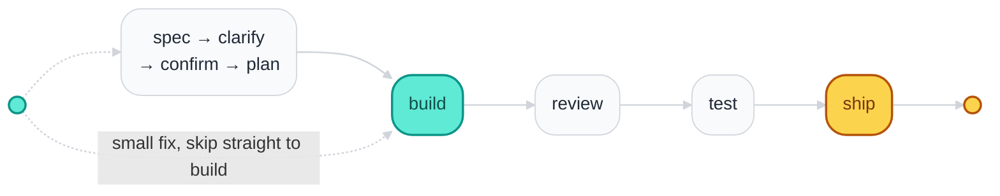

# dev-workflow

[](CHANGELOG.md)
[](LICENSE)
[](#install)

**[English](README.md)** · [Tiếng Việt](README.vi.md) · [日本語](README.ja.md)

**Requirement-first AI delivery workflow** for Claude Code, Cursor, Codex, and Antigravity: clear
specs → human confirm → TDD → machine-verified evidence → safe ship.

## Why

Without a gated process, AI coding often:

- Misses business rules
- Ships UI/logic bugs
- Marks "done" without evidence
- Drifts from what was actually confirmed

dev-workflow blocks progress until structural gates **G0–G9** and a required semantic **AUDIT**
pass. The checker (`bin/check-gates.sh`) is the source of truth — the AI must not invent a PASS.

## Install

```bash
git clone https://github.com/ninhlee99/dev-workflow.git
cd dev-workflow
bash install.sh          # Claude Code by default — see docs/INSTALL.md for Cursor/Codex/Antigravity
```

Then in any project:

```text
/dev-workflow TICKET-123 https://tracker/TICKET-123
```

Full install/update/uninstall paths per host: [docs/INSTALL.md](./docs/INSTALL.md).

## Flow

`:start` (also the bare `/dev-workflow` alias) is the single entry point for one ticket — analyze
once, ask once, then run to the first real stop. `learning`/`coaching` bootstrap or correct domain
knowledge independently, outside this pipeline.



Between `review` and `ship`, `fix` runs if findings are OPEN, `check` verifies gates, and `clean`
archives the worklog after — full sequence and every stage's job: [docs/USER-GUIDE.md
§3](./docs/USER-GUIDE.md#3-daily-flow-for-one-ticket).

An epic-shaped request runs through `:decompose` first, which splits it into child tickets and then
loops this same flow one child at a time — see [docs/USER-GUIDE.md](./docs/USER-GUIDE.md) for that
diagram and the full stage-by-stage walkthrough.

## Commands

| Command | Effect |
|---------|--------|
| `/dev-workflow:spec` | Testable ACs + Risk tier (P0/P1/P2) |
| `/dev-workflow:clarify` | Spec/intent vs running behavior; decisions recorded |
| `/dev-workflow:confirm` | Human sign-off — required before plan/build |
| `/dev-workflow:plan` / `:build` | TDD plan + implementation + coverage map |
| `/dev-workflow:review` / `:fix` | Neutral diff review + triage/fix |
| `/dev-workflow:test` | Real test run + machine evidence (SHA/CI/junit) |
| `/dev-workflow:ship` | Ship safety checklist (gate G9) |
| `/dev-workflow:audit` | Semantic coherence check + human sign-off |

Full command reference (all 16, arguments, and when each runs standalone):
[docs/USER-GUIDE.md §4](./docs/USER-GUIDE.md#4-commands-cheat-sheet).

## Gates & risk

Ten structural gates (**G0–G9**) plus a semantic **AUDIT** enforce the flow above; three Risk lanes
(**P0** hard / **P1** hard / **P2** fast) decide how much ceremony a ticket needs. The authoritative
definitions live in [references/stage-contract.md](./references/stage-contract.md) and
[references/risk.md](./references/risk.md) — [docs/USER-GUIDE.md §6](./docs/USER-GUIDE.md#6-gates-g0g9--audit-in-one-table)
has the reader-facing table.

## Learn more

| Doc | Content |
|-----|---------|
| **[docs/USER-GUIDE.md](./docs/USER-GUIDE.md)** | Full day-to-day guide: setup, daily flow, confirm phrase, worklog files, gates, pilot |
| [docs/INSTALL.md](./docs/INSTALL.md) | Install, update, uninstall, verify, host paths |
| [MARKETPLACE.md](./MARKETPLACE.md) | Host-specific install + smoke test |
| [STRUCTURE.md](./STRUCTURE.md) | Annotated repo layout |
| [CONTRIBUTING.md](./CONTRIBUTING.md) | How to change the plugin |
| [CHANGELOG.md](./CHANGELOG.md) | Version history |
| [references/](./references/) | Gates, risk, security, pilot, enforcement — AI + advanced users |

## License

[MIT](LICENSE)
