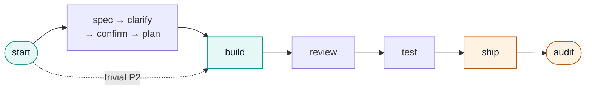

# dev-workflow

[](CHANGELOG.md)
[](LICENSE)
[](#install)

[English](README.md) · **[Tiếng Việt](README.vi.md)** · [日本語](README.ja.md)

**Quy trình giao hàng AI đặt yêu cầu lên hàng đầu** cho Claude Code, Cursor, Codex, và Antigravity:
spec rõ ràng → con người xác nhận → TDD → bằng chứng được máy xác minh → triển khai an toàn.

## Tại sao

Không có quy trình gate, AI viết code thường:

- Bỏ sót business rule
- Ship bug UI/logic
- Đánh dấu "xong" mà không có bằng chứng
- Trôi khỏi những gì đã thực sự được xác nhận

dev-workflow chặn tiến trình cho tới khi các gate cấu trúc **G0–G9** và **AUDIT** ngữ nghĩa bắt buộc
đều pass. Bộ kiểm tra (`bin/check-gates.sh`) là nguồn sự thật duy nhất — AI không được tự bịa ra PASS.

## Cài đặt

```bash
git clone https://github.com/ninhlee99/dev-workflow.git
cd dev-workflow
bash install.sh          # mặc định Claude Code — xem docs/INSTALL.md cho Cursor/Codex/Antigravity
```

Sau đó trong bất kỳ project nào:

```text
/dev-workflow TICKET-123 https://tracker/TICKET-123
```

Đường dẫn cài đặt/cập nhật/gỡ đầy đủ theo từng host: [docs/INSTALL.md](./docs/INSTALL.md).

## Luồng

`:start` (cũng là alias trần `/dev-workflow`) là điểm vào duy nhất cho một ticket — phân tích một
lần, hỏi một lần, rồi chạy tới điểm dừng thật đầu tiên. `learning`/`coaching` khởi tạo hoặc sửa domain
knowledge độc lập, nằm ngoài pipeline này.



Giữa `review` và `ship`, `fix` chạy nếu còn phát hiện OPEN, `check` xác minh các gate, và `clean`
lưu trữ worklog sau đó — toàn bộ chuỗi và vai trò từng stage: [docs/USER-GUIDE.md
§3](./docs/USER-GUIDE.md#3-daily-flow-for-one-ticket).

Một request dạng epic sẽ chạy qua `:decompose` trước, chia nó thành các ticket con rồi lặp lại chính
luồng này cho từng child một — xem [docs/USER-GUIDE.md](./docs/USER-GUIDE.md) để có sơ đồ đó và toàn
bộ hướng dẫn từng bước.

## Lệnh

| Lệnh | Tác dụng |
|---------|--------|
| `/dev-workflow:spec` | AC có thể kiểm chứng + Risk tier (P0/P1/P2) |
| `/dev-workflow:clarify` | Đối chiếu spec/intent với hành vi hệ thống hiện tại; ghi lại quyết định |
| `/dev-workflow:confirm` | Con người ký xác nhận — bắt buộc trước plan/build |
| `/dev-workflow:plan` / `:build` | Kế hoạch TDD + triển khai + bản đồ coverage |
| `/dev-workflow:review` / `:fix` | Review diff trung lập + triage/fix |
| `/dev-workflow:test` | Test thật + bằng chứng máy (SHA/CI/junit) |
| `/dev-workflow:ship` | Checklist an toàn khi ship (gate G9) |
| `/dev-workflow:audit` | Kiểm tra sự nhất quán ngữ nghĩa + con người ký xác nhận |

Tham chiếu lệnh đầy đủ (cả 16 lệnh, tham số, và khi nào mỗi lệnh chạy độc lập):
[docs/USER-GUIDE.md §4](./docs/USER-GUIDE.md#4-commands-cheat-sheet).

## Gate & Risk

Mười gate cấu trúc (**G0–G9**) cộng với một **AUDIT** ngữ nghĩa thực thi luồng ở trên; ba lane Risk
(**P0** hard / **P1** hard / **P2** fast) quyết định một ticket cần bao nhiêu nghi thức. Định nghĩa
có thẩm quyền nằm ở [references/stage-contract.md](./references/stage-contract.md) và
[references/risk.md](./references/risk.md) — [docs/USER-GUIDE.md §6](./docs/USER-GUIDE.md#6-gates-g0g9--audit-in-one-table)
có bảng dành cho người đọc.

## Tìm hiểu thêm

| Tài liệu | Nội dung |
|-----|---------|
| **[docs/USER-GUIDE.md](./docs/USER-GUIDE.md)** | Hướng dẫn hằng ngày đầy đủ: setup, luồng hằng ngày, câu confirm, tệp worklog, gate, pilot |
| [docs/INSTALL.md](./docs/INSTALL.md) | Cài đặt, cập nhật, gỡ, xác minh, đường dẫn theo host |
| [MARKETPLACE.md](./MARKETPLACE.md) | Cài đặt theo host cụ thể + smoke test |
| [STRUCTURE.md](./STRUCTURE.md) | Cây thư mục có chú thích |
| [CONTRIBUTING.md](./CONTRIBUTING.md) | Cách thay đổi plugin |
| [CHANGELOG.md](./CHANGELOG.md) | Lịch sử phiên bản |
| [references/](./references/) | Gate, risk, security, pilot, enforcement — cho AI + người dùng nâng cao |

## Giấy phép

[MIT](LICENSE)
