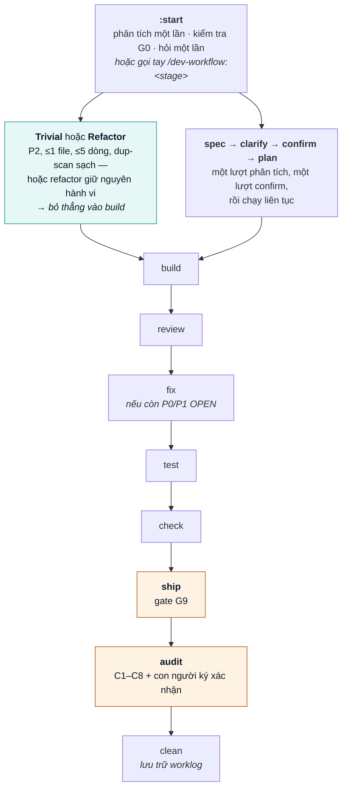
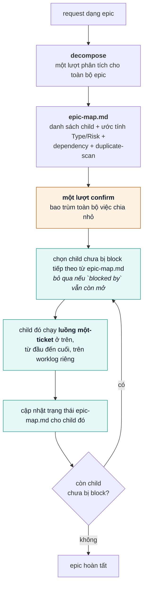

# dev-workflow

[](CHANGELOG.md)
[](LICENSE)
[](#installation)

[English](README.md) · **[Tiếng Việt](README.vi.md)** · [日本語](README.ja.md)

> **Quy trình giao hàng AI đặt yêu cầu lên hàng đầu.** Spec rõ ràng → con người xác nhận → TDD → bằng chứng được máy xác minh → triển khai an toàn. Bộ kiểm tra (`bin/check-gates.sh`) là nguồn sự thật duy nhất — AI không được tự bịa ra PASS.

**Hướng dẫn đầy đủ (khuyến nghị):** [docs/USER-GUIDE.md](./docs/USER-GUIDE.md)

---

## Mục lục

- [Tại sao](#why)
- [Luồng](#flow)
- [Cài đặt](#installation)
- [Bắt đầu nhanh](#quick-start)
- [Lệnh](#commands)
- [Gate & Risk](#gates--risk)
- [Câu xác nhận (bắt buộc)](#confirm-phrase-required)
- [Tệp worklog](#worklog-artifacts)
- [Enforcement qua CLI](#cli-enforcement)
- [CI tổ chức & Pilot](#org-ci--pilot)
- [Bản đồ tài liệu](#documentation-map)
- [Giấy phép](#license)

---

## Tại sao

Không có quy trình gate, AI viết code thường:

- Bỏ sót business rule
- Ship bug UI/logic
- Đánh dấu "xong" mà không có bằng chứng

dev-workflow chặn tiến trình cho tới khi các gate cấu trúc G0–G9 và AUDIT ngữ nghĩa bắt buộc đều pass,
được hỗ trợ bởi các lane Risk (P0/P1/P2), nguồn gốc bằng chứng (provenance), và chấm điểm pilot tùy chọn.

---

## Luồng

`learning`/`coaching` chạy độc lập với pipeline giao hàng — bạn gọi trực tiếp để khởi tạo hoặc sửa
domain knowledge. `:start` không bao giờ tự gọi chúng; nó dừng ở G0 và yêu cầu bạn tự chạy.

`:start` (cũng là alias trần `/dev-workflow`) là điểm vào duy nhất cho một ticket — cùng gate, không
đường tắt, chỉ ít điểm dừng hơn so với gọi từng stage bằng tay. `:decompose` chạy trước khi request
có dạng epic, sau đó chuyển giao luồng một-ticket cho từng child một.

### Luồng một ticket



`:start` dừng ở G0 và chuyển bạn sang `:learning`/`:coaching` nếu domain knowledge thiếu hoặc mâu
thuẫn — nó không bao giờ tự chạy hai lệnh đó thay bạn. `check-gates.sh --strict` là bước verify
chuẩn CI dùng trước merge và lại trước AUDIT; đây không phải một stage riêng trong pipeline, chỉ là
một flag trên `check`.

### Luồng epic (lặp lại luồng một-ticket ở trên, từng child một)



`:decompose` ghi `epic-map.md` ở cấp project (không nằm trong worklog của bất kỳ ticket nào) và chỉ
chuyển giao child **đầu tiên** chưa bị block — nó không bao giờ tự gọi `:spec`/`:start` cho nhiều
child cùng lúc. Mỗi child có luồng một-ticket đầy đủ của riêng nó (Risk tier riêng, `CONFIRM G3`
riêng, G0–G9 + AUDIT riêng) — lượt confirm duy nhất của epic chỉ xác nhận việc chia nhỏ và các câu
hỏi ở cấp epic, không thay thế gate riêng của bất kỳ child nào. Một child P0 phát hiện trong lúc
decompose bị gate chặt chẽ y hệt như một ticket P0 phát hiện theo cách khác. `epic-map.md` chưa được
kiểm chứng với epic nhiều cấp (child tự phân nhánh tiếp) — chỉ coi sơ đồ dependency là đáng tin cho
danh sách child phẳng; nếu một child trông như cần decompose tiếp, hãy nói rõ điều đó.

| Bước | Ý nghĩa |
|------|---------|
| decompose | Chia epic thành các ticket con + dependency; một lượt confirm bao trùm việc chia nhỏ |
| start | Điểm vào mặc định: phân tích một lần, hỏi một lần, chạy tới điểm dừng thật đầu tiên |
| learning / coaching | AI học domain; bạn sửa các lỗi hiểu |
| spec | AC có thể kiểm chứng + **Risk P0/P1/P2** (+ `02b-security.md` nếu P0) |
| clarify | Đối chiếu spec/intent theo Type với hành vi hệ thống hiện tại; ghi lại quyết định |
| confirm | AI đưa cho bạn dòng `CONFIRM G3:…` đã điền sẵn; sửa tên rồi gửi lại (xem bên dưới) |
| plan / build | Kế hoạch TDD + triển khai + bản đồ coverage |
| review / fix / test | Phát hiện trong diff + triage/fix + bằng chứng máy (SHA/CI/junit) |
| check / ship / audit / clean | Gate cấu trúc; an toàn khi ship; hoàn thiện ngữ nghĩa; lưu trữ worklog |

`:start` và các lệnh `/dev-workflow:<stage>` có tên riêng đều là cách hợp lệ để làm một ticket —
`:start` giảm tối đa số điểm dừng cho "cứ làm cho xong"; gọi từng stage tự tay cho bạn toàn quyền
kiểm soát một bước cụ thể. Không cách nào làm yếu gate: `:start` chạy đúng những kiểm tra
`check-gates.sh` mà đường thủ công cũng chạy.

**Mọi stage ở trên đều chạy độc lập — sơ đồ là đường đầy đủ, không phải yêu cầu bắt buộc.** Bạn có
thể gọi thẳng bất kỳ `/dev-workflow:<stage>` nào trên một ticket chưa có artifact thượng nguồn nào
trên đĩa; `clarify`, `plan`, và `build` sẽ tự phân tích ticket thay cho output `spec`/`clarify`/`plan`
lẽ ra chúng đọc, và đánh dấu kết quả là `Source: self-analyzed (no upstream artifact)` để các stage
sau và con người biết nó không được xây từ scope đã xác nhận. Một lỗi chính tả một dòng không cần đi
trọn vòng `spec` → `clarify` → `confirm`: chạy thẳng `/dev-workflow:build <Ticket>` và nó sẽ lập kế
hoạch cùng triển khai dựa trên chính cách nó đọc ticket. Hai stage duy nhất không bao giờ mềm hóa
theo cách này là `confirm` và `audit` — chữ ký con người của chúng không thể tự phân tích thay được.
Mỗi stage khác mềm hóa tới mức nào (cảnh báo vs. tự phân tích vs. dừng hẳn) là tùy từng stage, không
đồng nhất — xem cột `(preferred)` trong `references/stage-contract.md` để biết quy tắc chính xác cho
từng stage, và mục "Independence" trong `references/workflow.md` để biết chính xác stage nào rơi lại
theo cách này.

---

## Cài đặt

### Yêu cầu

- Bash 3.2+
- Một trong: Claude Code, Cursor, Codex, Antigravity
- Git
- `agy` chỉ cần cho `--agy` hoặc `--all`

### Clone và chọn coding agent

```bash
git clone https://github.com/ninhlee99/dev-workflow.git
cd dev-workflow
bash install.sh                         # mặc định: chỉ Claude
bash install.sh --cursor                # chỉ Cursor
bash install.sh --codex                 # chỉ Codex
bash install.sh --agy                   # chỉ Antigravity (cần agy)
bash install.sh --all                   # mọi agent được hỗ trợ
```

`install.sh` chỉ cài host được chọn. Cursor và Codex nhận đủ 18 stage skill dạng live; thư mục
skill của chúng link về clone này, nên nội dung skill không bao giờ trở thành bản copy lỗi thời.
Nó ghi các tệp tích hợp host dưới `~/.claude`, `~/.cursor`, `~/.codex`, và tùy chọn `~/.agents`;
nó không sửa source của sản phẩm. Xem hướng dẫn cài đặt/cập nhật/xác minh đầy đủ:
[docs/INSTALL.md](./docs/INSTALL.md).

Chọn đúng một flag target. Các flag xung đột sẽ bị từ chối, và `--all` kiểm tra `agy` trước khi
thay đổi bất kỳ host nào.

### Claude Code

```text
/plugin marketplace add https://github.com/ninhlee99/dev-workflow
/plugin install dev-workflow@dev-workflow-marketplace
/reload-plugins
```

### Cách tương đương thủ công cho Antigravity

```bash
bash hosts/antigravity/rebuild.sh
agy plugin validate ./hosts/antigravity
agy plugin install ./hosts/antigravity
```

Chi tiết host: [MARKETPLACE.md](./MARKETPLACE.md).

### Cập nhật

Chạy từ clone hiện có, dùng cùng target đã dùng lúc cài đặt:

```bash
bash update.sh             # chỉ Claude (mặc định)
bash update.sh --cursor    # chỉ Cursor
bash update.sh --codex     # chỉ Codex
bash update.sh --agy       # chỉ Antigravity (cần agy)
bash update.sh --all       # mọi agent được hỗ trợ (cần agy)
```

Update từ chối worktree bẩn, pull với `--ff-only`, và chỉ refresh host được chọn. Nó không bao giờ
stash, reset, hay ghi đè thay đổi repository cục bộ.

### Gỡ cài đặt

Dùng cùng target như lúc cài đặt:

```bash
bash uninstall.sh             # chỉ Claude (mặc định)
bash uninstall.sh --cursor    # chỉ Cursor
bash uninstall.sh --codex     # chỉ Codex
bash uninstall.sh --agy       # chỉ Antigravity (cần agy)
bash uninstall.sh --all       # mọi agent được hỗ trợ (cần agy)
```

Uninstall chỉ xóa các entry host thuộc sở hữu dev-workflow. Nó giữ nguyên clone repository,
worklog, cấu hình host không liên quan, và mọi tệp Codex marketplace đã bị sửa.

---

## Bắt đầu nhanh

```text
# 1) Lần đầu trên một project
/dev-workflow:learning

# 2) Request dạng epic? Chia nhỏ trước khi mở bất kỳ worklog con nào.
/dev-workflow:decompose "split the payment monolith into its own service"
# → epic-map.md + một lượt confirm, sau đó chuyển giao child đầu tiên chưa bị block

# 3) Bắt đầu một ticket (điểm vào mặc định — phân tích một lần, hỏi một lần, chạy tới điểm dừng thật đầu tiên)
/dev-workflow TICKET-123 https://tracker/TICKET-123

# ...hoặc không cần Ticket ID gì cả — vẫn chạy được, không cần ID từ đầu
/dev-workflow "fix the confirm-order button text"
# → AI tự suy ra worklogs/adhoc-confirm-btn-text/ khi có quyết định cần lưu;
#   việc Q&A/chỉ-đọc thuần túy không cần worklog nào cả

# ...hoặc một fix thực sự trivial (1 file, ≤5 dòng, không đổi định danh công khai,
# duplicate-scan sạch) — không hỏi, chạy luôn và báo cáo:
/dev-workflow "fix the typo in the error message"
# → :build chạy ngay lập tức, một dòng log INDEX, không worklog đầy đủ, không chờ trả lời

# 4) Đường thủ công điển hình
/dev-workflow:spec     TICKET-123
/dev-workflow:clarify  TICKET-123
/dev-workflow:confirm  TICKET-123    ← AI đưa sẵn dòng CONFIRM G3:; sửa tên, gửi lại
/dev-workflow:plan     TICKET-123
/dev-workflow:build    TICKET-123
/dev-workflow:review   TICKET-123
/dev-workflow:fix      TICKET-123    ← nếu còn phát hiện P0/P1 OPEN
/dev-workflow:test     TICKET-123
/dev-workflow:check    TICKET-123
/dev-workflow:ship     TICKET-123
/dev-workflow:audit    TICKET-123    ← bắt buộc để hoàn tất P0/P1; AUDIT CONFIRM của con người
/dev-workflow:clean    TICKET-123    ← sau khi xong; giải phóng bộ nhớ worklog

# Bất cứ lúc nào
/dev-workflow:status TICKET-123
```

Chat và setup theo ngôn ngữ của bạn (xem [references/locale.md](./references/locale.md)); các ví
dụ trên dùng tiếng Anh cho dễ đọc. Ticket ID là tùy chọn cho các stage hội thoại (`:spec`,
`:clarify`, `:plan`, `:build`, `:start`, `:decompose`) — bỏ trống thì stage vẫn chạy; xem ghi chú
`[Ticket]` trong mục [Lệnh](#commands) bên dưới để biết chính xác khi nào worklog được tạo.

Worklog nằm ở: `~/.workspaces/<project-slug>/worklogs/<Ticket_ID-or-adhoc-slug>/`.

Hướng dẫn từng bước kèm ví dụ: [docs/USER-GUIDE.md](./docs/USER-GUIDE.md).

---

## Lệnh

| Lệnh | Tham số | Tác dụng |
|---------|-----------|--------|
| `/dev-workflow:decompose` | `<epic description/path>` | Chia epic thành ticket con + dependency; `epic-map.md`, một lượt confirm |
| `/dev-workflow:learning` | `[brief/path]` | AI xây `domain-knowledge/`; hỏi khi chưa rõ |
| `/dev-workflow:coaching` | `<topic/ticket>` | Bạn dạy các sửa lỗi / spec mới hoặc đã đổi |
| `/dev-workflow` | `[Ticket] [URL]` | Điểm vào mặc định: phân tích một lần, hỏi một lần, chạy tới điểm dừng thật đầu tiên; Ticket tùy chọn, tự suy ra nếu bỏ trống |
| `/dev-workflow:spec` | `[Ticket] [URL/spec]` | Đặt Type/Risk, provenance, AC; P0 → tệp security; Ticket tùy chọn, tự suy ra nếu bỏ trống |
| `/dev-workflow:clarify` | `[Ticket] [decision]` | Viết clarify report + QA log; Ticket tùy chọn, tự suy ra nếu bỏ trống |
| `/dev-workflow:confirm` | `<Ticket>` | Đưa cho người dùng dòng `CONFIRM G3:` đã điền sẵn; ghi INDEX + `03b-human-confirm.md` |
| `/dev-workflow:plan` | `[Ticket]` | Kế hoạch TDD ánh xạ theo AC/claim; Ticket tùy chọn, tự suy ra nếu bỏ trống |
| `/dev-workflow:build` | `[Ticket]` | Triển khai + bản đồ coverage; tự phân tích nếu chưa có plan; Ticket tùy chọn, tự suy ra nếu bỏ trống |
| `/dev-workflow:review` | `<Ticket>` | Review diff trung lập + How/By (`06-review-qa.md`) |
| `/dev-workflow:fix` | `<Ticket>` | Triage phát hiện; chỉ fix cái hợp lý (`06c-fix-log.md`) |
| `/dev-workflow:test` | `<Ticket>` | Test thật + SHA/CI/junit (`06b-test-evidence.md`) |
| `/dev-workflow:check` | `<Ticket> [slug] [G8\|G9\|AUDIT]` | Chạy bộ kiểm tra tất định |
| `/dev-workflow:ship` | `<Ticket>` | Điền `07-ship.md` (G9); từ chối nếu checker fail |
| `/dev-workflow:audit` | `<Ticket>` | Kiểm tra sự nhất quán C1–C8; yêu cầu con người ký xác nhận |
| `/dev-workflow:clean` | `<Ticket> [--force] [--purge]` | Chỉ lưu trữ/xóa worklog của ticket đó |
| `/dev-workflow:status` | `[Ticket]` | Trạng thái gate + knowledge |
| `/dev-workflow:feedback` | `[free text]` | Báo cáo bug/điểm khó chịu của dev-workflow như một GitHub issue |

`[Ticket]` = tùy chọn — nếu bỏ trống, stage vẫn chạy; một tên worklog ngắn `adhoc-<slug>` chỉ được
suy ra khi có quyết định cần lưu lại (xem `references/task-isolation.md`). `<Ticket>` = vẫn bắt
buộc — các stage này ghi/xác minh bằng chứng được máy kiểm tra gắn với đúng một ticket.

---

## Gate & Risk

Bảng này là bản tóm tắt cho người đọc. `references/stage-contract.md` là nguồn thẩm quyền — nếu hai
bên khác nhau, tệp contract thắng; sửa tệp đó trước, rồi mới đồng bộ bảng này.

| Gate | PASS nghĩa là | Thử lại với |
|------|------------|------------|
| **G0** | Domain knowledge bao phủ ticket | `:learning` / `:coaching` |
| **G1** | Một Type + Risk, provenance yêu cầu, AC (+ security nếu P0) | `:spec` |
| **G2** | Xung đột đã được quyết định (P2 mềm trừ khi `--strict`) | `:clarify` |
| **G3** | Human confirm trong INDEX **và** `03b-human-confirm.md` (P2 mềm trừ khi `--strict`) | `:confirm` |
| **G4** | Plan đã ánh xạ (P2 mềm trừ khi `--strict`) | `:plan` |
| **G5** | Không còn câu hỏi OPEN (P2 mềm trừ khi `--strict`) | `:clarify` |
| **G6** | Bản đồ coverage + PASS | `:build` |
| **G7** | Review: không còn P0/P1 OPEN + bằng chứng (P2 mềm trừ khi `--strict`) | `:review` / `:fix` |
| **G8** | Test + bằng chứng máy (`--strict` = chuẩn CI) | `:test` |
| **G9** | An toàn khi ship (canary/soak/on-call/SLO/rollback) | `:ship` |
| **AUDIT** | Tám cặp coherence có bằng chứng + con người ký xác nhận; không UNCLEAR/INCOHERENT | `:audit` |

| Risk | Lane | Ghi chú |
|------|------|-------|
| **P0** | Hard | Tiền/auth/PII/legacy — dual CONFIRM, security, G0–G9 + AUDIT |
| **P1** | Hard | Thay đổi sản phẩm mặc định — đầy đủ G0–G9 + AUDIT |
| **P2** | Fast | Chore — G2/G3/G4/G5/G7 mềm trừ khi `--strict`; không cần vòng CONFIRM của con người |

**Trivial** (một bộ lọc trên P2, không phải tier thứ 4): P2 + ≤1 file + ≤5 dòng + không đổi định
danh công khai + duplicate-scan sạch → `:start` bỏ qua bước "đề nghị và chờ" của P2 và chạy thẳng
`:build`, ghi một dòng INDEX và báo cáo sau thay vì hỏi trước. Quay lại P2 bình thường nếu
duplicate-scan tìm thấy nơi khác cùng nội dung. Con số `≤5 dòng` là một ước lượng khởi điểm chưa
được kiểm chứng (cùng trạng thái với ngưỡng chặn 4-claim của epic-signal) — xem `references/risk.md`
mục "Trivial".

Chi tiết: [references/risk.md](./references/risk.md). Interface stage có thẩm quyền là
[references/stage-contract.md](./references/stage-contract.md); mọi skill tuân theo tiêu chuẩn bằng
chứng và trung thực trong [references/skill-quality.md](./references/skill-quality.md).

### WAIVE

Trên `INDEX.md`:

```text
- G4/task-2 | reason | owner | 2026-12-31 | PM note
```

Không WAIVE cho tiền/quyền hạn/legacy nếu không có PM. P0 không thể WAIVE G3/G8.

---

## Câu xác nhận (bắt buộc)

`:confirm` đưa cho bạn dòng này đã điền sẵn (ticket + ngày đã có sẵn) — sửa tên rồi gửi lại:

```text
CONFIRM G3: TICKET-123 Your Name 2026-08-11
```

P0 cần thêm:

```text
CONFIRM G3-PM: TICKET-123 PM Name 2026-08-11
```

Cấm dùng trong trường tên: `AI`, `ChatGPT`, `Claude`, `Copilot`, `Cursor`, `Assistant`, `Bot`.
Phải được lưu trong cả **INDEX.md** và **03b-human-confirm.md** với `Source: user-message`.

---

## Tệp worklog

```
~/.workspaces/<project-slug>/
├── PROJECT.md
├── domain-knowledge/
├── repos/<repo-slug>/
├── pilot/PILOT-v0.4.md          # bằng chứng đo lường tùy chọn
└── worklogs/<Ticket_ID>/
    ├── INDEX.md                 # Risk, Pilot, gate, CONFIRM, waiver
    ├── 01-intent.md
    ├── 02-spec.md
    ├── 02b-security.md          # chỉ P0
    ├── 03-clarify-report.md
    ├── 03-qa-log.md
    ├── 03b-human-confirm.md     # nội dung CONFIRM chính xác của con người
    ├── 04-plan.md
    ├── 05-impl-log.md
    ├── 06-review-qa.md
    ├── 06c-fix-log.md            # sau :fix (triage)
    ├── 06b-test-evidence.md
    ├── 07-ship.md
    └── 08-semantic-audit.md       # C1–C8 + AUDIT CONFIRM
```

---

## Enforcement qua CLI

```bash
export DEV_WORKFLOW_PLUGIN=/path/to/dev-workflow

# Ngưỡng cấu trúc trước khi merge
"$DEV_WORKFLOW_PLUGIN/bin/check-gates.sh" TICKET-123 \
  --project my-project --min G9 --strict

# Kiểm tra cuối cùng cho P0/P1 sau semantic audit + con người ký xác nhận
"$DEV_WORKFLOW_PLUGIN/bin/check-gates.sh" TICKET-123 \
  --project my-project --min AUDIT --strict

# Chấm điểm pilot (sau 10 ticket)
"$DEV_WORKFLOW_PLUGIN/bin/pilot-score.sh" \
  workspaces/my-project/pilot/PILOT-v0.4.md
```

| Flag | Mặc định | Ý nghĩa |
|------|---------|---------|
| `--project` | tự động | Slug của project |
| `--min` | `G8` | Kiểm tra tới `G0`…`G9` hoặc `AUDIT`; kiểm tra cuối P0/P1 dùng `AUDIT` |
| `--strict` | tắt | Xác minh SHA/junit; kéo theo `--verify-net`; không có P2 mềm; không WAIVE G8 |
| `--verify-net` | tắt* | HTTP HEAD tới CI URL (*bật khi `--strict`) |
| `--json` | tắt | Kết quả dạng máy đọc |

Exit code: `0` PASS · `1` FAIL · `2` lỗi cách dùng/đường dẫn.

---

## CI tổ chức & Pilot

1. Copy [templates/ci/github-actions-dev-workflow.yml](./templates/ci/github-actions-dev-workflow.yml) vào repo **sản phẩm**.
2. Bắt buộc status check `dev-workflow-gates` trên nhánh mặc định.
3. Chạy pilot 10 ticket → `pilot-score.sh` phải exit 0.

Xem [docs/USER-GUIDE.md §7](./docs/USER-GUIDE.md#7-pilot-prove-the-workflow-works) và [references/maturity.md](./references/maturity.md).

---

## Bản đồ tài liệu

| Tài liệu | Đối tượng | Nội dung |
|-----|----------|---------|
| **[docs/USER-GUIDE.md](./docs/USER-GUIDE.md)** | Developer | Hướng dẫn sử dụng hằng ngày đầy đủ |
| [docs/INSTALL.md](./docs/INSTALL.md) | Người cài đặt | Cài đặt, cập nhật, xác minh, đường dẫn theo host |
| [MARKETPLACE.md](./MARKETPLACE.md) | Người cài đặt | Cài đặt theo host cụ thể + smoke test |
| [STRUCTURE.md](./STRUCTURE.md) | Contributor | Cây thư mục có chú thích |
| [CONTRIBUTING.md](./CONTRIBUTING.md) | Contributor | Cách thay đổi plugin |
| [CHANGELOG.md](./CHANGELOG.md) | Mọi người | Lịch sử phiên bản |
| [references/](./references/) | AI + người dùng nâng cao | Gate, risk, security, pilot, enforce |

---

## Giấy phép

[MIT](LICENSE)
